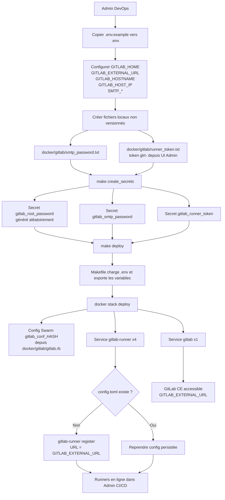
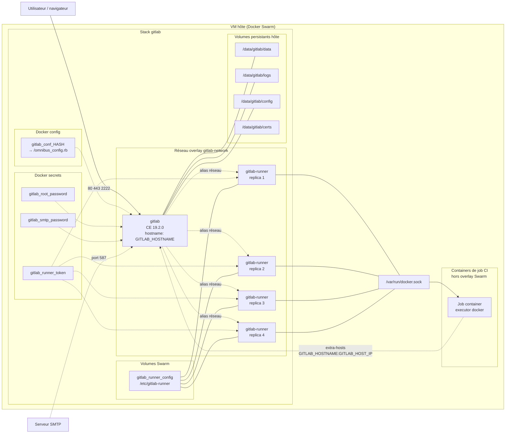
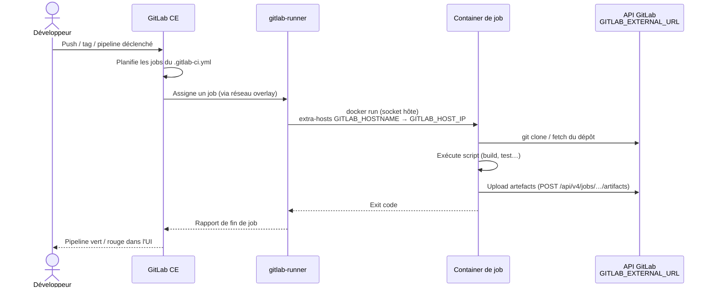
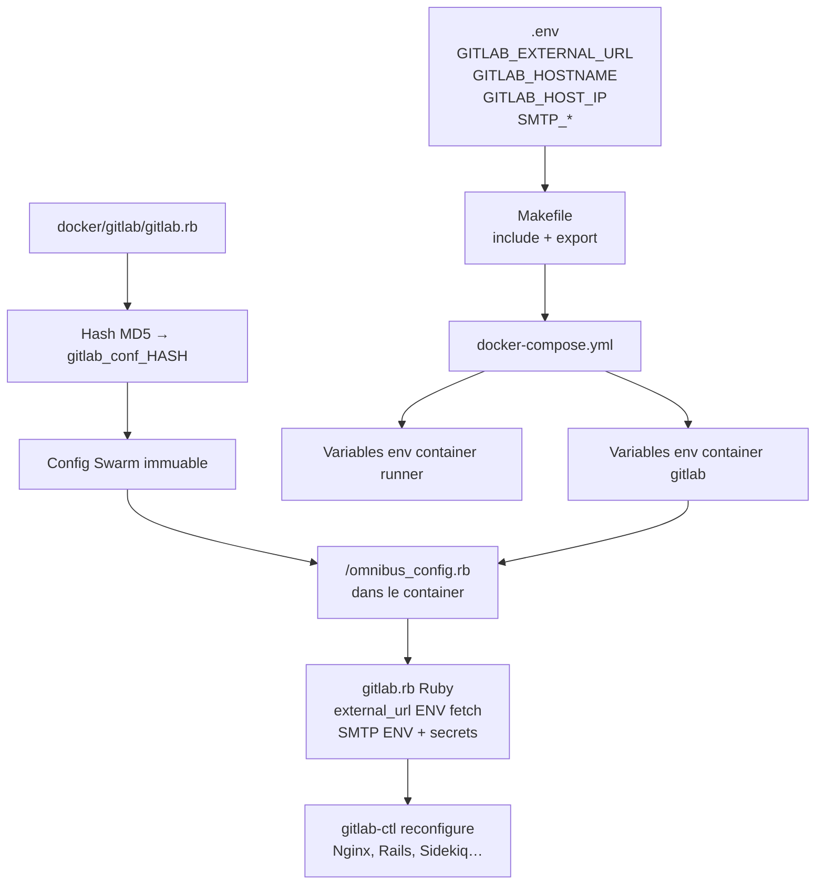

# Déploiement de GitLab CE avec Docker Swarm pour Seris

Ce guide décrit comment déployer et gérer une instance GitLab CE dans un environnement Docker Swarm pour l'entreprise **Seris**. L'outil principal du projet est le **`Makefile`** : il charge le `.env`, crée les secrets et déploie la stack sans commandes manuelles dispersées.

---

## Sommaire

1. [Démarrage rapide](#démarrage-rapide)
2. [Structure du dépôt](#structure-du-dépôt)
3. [Makefile — référence](#makefile--référence)
4. [Configuration `.env`](#configuration-env)
5. [Fichiers sensibles (non versionnés)](#fichiers-sensibles-non-versionnés)
6. [Guide pas à pas détaillé](#guide-pas-à-pas-détaillé)
7. [Vérification et maintenance](#vérification-et-maintenance)
8. [Réinitialisation](#réinitialisation-de-linstance-gitlab)
9. [Notes importantes](#notes-importantes)
10. [Flux fonctionnel (Mermaid)](#flux-fonctionnel-mermaid)

---

## Démarrage rapide

Checklist pour un **premier déploiement** sur une VM vierge :

| Étape | Action | Commande |
|-------|--------|----------|
| 1 | Cloner le dépôt | `git clone … && cd gitlab-ce` |
| 2 | Activer Swarm (une fois) | `docker swarm init` |
| 3 | Créer le `.env` | `cp .env.example .env` puis éditer |
| 4 | Placer les certificats TLS | fichiers dans `$(GITLAB_HOME)/certs/` |
| 5 | Créer le mot de passe SMTP | `echo "…" > docker/gitlab/smtp_password.txt` |
| 6 | Créer le token runner | token `glrt-…` dans `docker/gitlab/runner_token.txt` |
| 7 | Tout installer | **`make all`** |
| 8 | Vérifier | **`make status`** puis ouvrir `GITLAB_EXTERNAL_URL` |

> Pour voir toutes les commandes disponibles à tout moment : **`make help`**

**Mise à jour** (après `git pull` ou modification de `gitlab.rb` / `docker-compose.yml`) :

```bash
make deploy
```

**Création des secrets uniquement** (première fois ou secrets manquants) :

```bash
make create_secrets
```

---

## Structure du dépôt

```
gitlab-ce/
├── .env.example          # Modèle de variables (à copier vers .env)
├── .env                  # Variables locales (NON versionné — créer manuellement)
├── Makefile              # Point d'entrée : déploiement et maintenance
├── docker-compose.yml    # Stack Swarm (gitlab + gitlab-runner)
├── docker/
│   └── gitlab/
│       ├── gitlab.rb           # Config Omnibus (versionnée, hashée au deploy)
│       ├── smtp_password.txt   # Mot de passe SMTP (NON versionné)
│       ├── runner_token.txt    # Token glrt- runner (NON versionné)
│       └── root_password.txt   # Optionnel, généré par create_secrets (NON versionné)
└── README.md
```

| Fichier | Rôle |
|---------|------|
| `Makefile` | Charge `.env`, valide les variables, orchestre volumes / secrets / deploy |
| `docker-compose.yml` | Services, réseau overlay, secrets, config Swarm `gitlab_conf_<hash>` |
| `docker/gitlab/gitlab.rb` | Configuration GitLab (URL, nginx, SMTP, Pages…) injectée via Swarm config |
| `.env` | Valeurs par environnement (URL, hostname, IP VM, SMTP) |

---

## Makefile — référence

Le Makefile est le **seul outil nécessaire** pour le cycle de vie de l'instance. Il :

* charge automatiquement le `.env` (`include .env` + `export`) — indispensable car `docker stack deploy` ne lit pas le `.env` ;
* calcule le hash MD5 de `gitlab.rb` → nom de config Swarm `gitlab_conf_<hash>` (configs immuables) ;
* nettoie les anciennes configs Swarm après chaque `deploy`.

### Commandes

| Commande | Description | Quand l'utiliser |
|----------|-------------|------------------|
| `make help` | Affiche l'aide des cibles | À tout moment |
| `make all` | `init_volumes` → `create_secrets` → `deploy` | **Premier déploiement** sur une VM |
| `make init_volumes` | Crée `data/`, `logs/`, `config/`, `certs/` sous `GITLAB_HOME` + `chown 1000:1000` | Première install ou répertoires manquants |
| `make create_secrets` | Crée les secrets Docker s'ils n'existent pas encore | Première install ; **idempotent** (ne touche pas aux secrets existants) |
| `make deploy` | `docker stack deploy` + nettoyage des configs obsolètes | Après `git pull`, modification de `gitlab.rb` ou `docker-compose.yml` |
| `make status` | `docker stack ps` + `docker service ls` | Vérifier que les services tournent |
| `make reinit` | `docker stack rm` puis `make all` | Redéploiement complet de la stack (les **données** dans `GITLAB_HOME` sont conservées) |

### Détail de `make create_secrets`

| Secret Docker | Source | Comportement |
|---------------|--------|--------------|
| `gitlab_root_password` | Généré aléatoirement (`openssl rand`) | Créé une seule fois ; mot de passe initial du compte `root` |
| `gitlab_smtp_password` | Fichier `docker/gitlab/smtp_password.txt` | Mot de passe **statique** du serveur SMTP (non régénéré) |
| `gitlab_runner_token` | Fichier `docker/gitlab/runner_token.txt` | Token `glrt-…` créé dans l'UI Admin → CI/CD → Runners |

### Détail de `make deploy`

1. Affiche le hash de config utilisé (`gitlab_conf_<hash>`).
2. Exécute `docker stack deploy --detach=true -c docker-compose.yml gitlab`.
3. Supprime les configs Swarm `gitlab_conf_*` obsolètes (celles dont le hash ne correspond plus).

### Variables vérifiées au démarrage du Makefile

| Variable | Obligatoire | Exemple |
|----------|-------------|---------|
| `GITLAB_HOME` | Oui | `/data/gitlab` |
| `GITLAB_EXTERNAL_URL` | Oui | `http://gitlab.local` |
| `GITLAB_HOSTNAME` | Oui | `gitlab.local` (sans `http://`) |
| `GITLAB_HOST_IP` | Recommandé | `172.16.100.121` (IP de la VM) |
| `SMTP_*` | Recommandé | Voir `.env.example` |

Si une variable obligatoire manque, `make` s'arrête avec un message d'erreur explicite.

---

## Configuration `.env`

Copier le modèle et adapter :

```bash
cp .env.example .env
```

Exemple complet :

```bash
GITLAB_HOME=/data/gitlab

# URL complète pour Omnibus (external_url) — avec schéma http/https
GITLAB_EXTERNAL_URL=http://gitlab.local
# Hostname seul (sans schéma) pour Docker hostname, aliases réseau et runners
GITLAB_HOSTNAME=gitlab.local

# IP de la VM hôte : utilisée par les containers de job CI pour résoudre GITLAB_HOSTNAME
GITLAB_HOST_IP=172.16.100.121

# SMTP (valeurs non sensibles — le mot de passe est géré via Docker secret)
SMTP_ADDRESS=mta.securit.fr
SMTP_PORT=587
SMTP_USER_NAME="GitLab Notifier <gitlab-info@seris.fr>"
SMTP_DOMAIN=securit.fr
```

| Variable | Usage |
|----------|-------|
| `GITLAB_EXTERNAL_URL` | `external_url` GitLab + URL d'enregistrement des runners |
| `GITLAB_HOSTNAME` | Hostname Docker, alias réseau Swarm, résolution DNS dans les jobs CI |
| `GITLAB_HOST_IP` | `extra-hosts` des containers de job : `GITLAB_HOSTNAME` → IP VM |

> Le `.env` n'est **pas versionné**. Le Makefile l'exporte vers `docker-compose.yml` et `gitlab.rb` (`ENV['…']`).

---

## Fichiers sensibles (non versionnés)

Ces fichiers sont listés dans `.gitignore` — **ne jamais les committer** :

| Fichier | Contenu | Comment l'obtenir |
|---------|---------|-------------------|
| `.env` | Variables d'environnement | `cp .env.example .env` |
| `docker/gitlab/smtp_password.txt` | Mot de passe SMTP | Fourni par l'équipe infra / messagerie |
| `docker/gitlab/runner_token.txt` | Token `glrt-…` | Admin → CI/CD → Runners → Créer un runner d'instance |
| `docker/gitlab/root_password.txt` | Optionnel | Généré par `make create_secrets` si besoin de sauvegarde locale |

---

## Guide pas à pas détaillé

### Prérequis

* Docker CE installé sur la machine hôte (Ubuntu 24.04 ou similaire)
* Docker Compose (version compatible avec Swarm)
* Accès root ou sudo sur la machine hôte
* Ports ouverts :

  * SSH GitLab : 2222 (ou un autre si personnalisé)
  * HTTP : 80
  * HTTPS : 443

### Étape 1 : Initialiser le mode Swarm

Si le Docker Swarm n'est pas encore activé sur le serveur hôte :

```bash
docker swarm init
```

> Cela permet d'utiliser `docker stack deploy` et de gérer les services en mode Swarm.

### Étape 2 : Préparer l'environnement

**Option recommandée** — tout en une commande après configuration du `.env` et des fichiers sensibles :

```bash
make all
```

**Option manuelle** — équivalent de `make all` :

```bash
make init_volumes    # répertoires + permissions
make create_secrets  # secrets Docker (idempotent)
make deploy          # stack Swarm
```

#### Certificats TLS

Le répertoire `$(GITLAB_HOME)/certs` (créé par `make init_volumes`) doit contenir :

* `gitlab.securit.fr.crt`
* `gitlab.securit.fr.key`

Ces chemins correspondent à `gitlab.rb` (`gitlab_rails['nginx']['ssl_certificate']` et `ssl_certificate_key`).

#### Volumes mappés (`docker-compose.yml`)

```yaml
volumes:
  - ${GITLAB_HOME}/data:/var/opt/gitlab
  - ${GITLAB_HOME}/logs:/var/log/gitlab
  - ${GITLAB_HOME}/config:/etc/gitlab
```

### Étape 3 : Secrets (alternative manuelle)

Si vous préférez ne pas utiliser `make create_secrets` :

```bash
cd gitlab-ce
docker secret rm gitlab_root_password 2>/dev/null || true
openssl rand -base64 24 | tee ./docker/gitlab/root_password.txt | docker secret create gitlab_root_password -

echo "<mot-de-passe-smtp>" > ./docker/gitlab/smtp_password.txt
docker secret rm gitlab_smtp_password 2>/dev/null || true
docker secret create gitlab_smtp_password ./docker/gitlab/smtp_password.txt

echo "glrt-..." > ./docker/gitlab/runner_token.txt
docker secret rm gitlab_runner_token 2>/dev/null || true
docker secret create gitlab_runner_token ./docker/gitlab/runner_token.txt
```

> Les runners (4 replicas) s'enregistrent au démarrage avec `GITLAB_EXTERNAL_URL`. La config runner est persistée dans le volume Swarm `gitlab_runner_config`.

### Étape 4 : Déployer

```bash
make deploy
```

Équivalent manuel (après `set -a; source .env; set +a` et export du hash config) :

```bash
export GITLAB_CONFIG_HASH=$(md5sum docker/gitlab/gitlab.rb | cut -c1-8)
docker stack deploy -c docker-compose.yml gitlab
```

> Les configs Swarm sont **immuables**. Le Makefile versionne `gitlab.rb` sous `gitlab_conf_<hash>` pour éviter l'erreur `only updates to Labels are allowed`.

---

## Vérification et maintenance

```bash
make status
```

Autres commandes utiles :

```bash
docker ps
docker service logs gitlab_gitlab --tail 50
docker service logs gitlab_gitlab-runner --tail 50
docker exec $(docker ps -q -f name=gitlab_gitlab.1) gitlab-ctl status
```

**Scénarios courants :**

| Besoin | Commande |
|--------|----------|
| Mettre à jour après `git pull` | `make deploy` |
| Modifier `gitlab.rb` ou `docker-compose.yml` | `make deploy` |
| Vérifier les runners | Admin → CI/CD → Runners |
| Changer l'URL GitLab | Éditer `GITLAB_EXTERNAL_URL` / `GITLAB_HOSTNAME` dans `.env`, puis `make deploy` |

---

## Réinitialisation de l'instance GitLab

Si vous devez **réinitialiser complètement la stack** (les données dans `GITLAB_HOME` sont conservées) :

```bash
make reinit
```

Équivalent manuel :

```bash
docker stack rm gitlab
```

Puis après quelques secondes :

```bash
make all
```

Pour une réinitialisation **manuelle complète** (y compris suppression des secrets) :

```bash
docker config ls --format '{{.Name}}' | grep '^gitlab_conf_' | xargs -r docker config rm
docker secret rm gitlab_root_password 2>/dev/null
docker secret rm gitlab_smtp_password 2>/dev/null
docker secret rm gitlab_runner_token 2>/dev/null
docker rm -f $(docker ps -aq --filter "name=gitlab") 2>/dev/null || true
make create_secrets
make deploy
```

---

## Notes importantes

* Les mots de passe et tokens doivent **toujours être gérés via Docker secrets** ou fichiers non versionnés (`.gitignore`).
* Les volumes persistants doivent être créés avec les permissions correctes (`chown -R 1000:1000`) pour permettre au conteneur GitLab de fonctionner correctement.
* L'`external_url` est configuré via **`GITLAB_EXTERNAL_URL`** dans le `.env` (pas de modification manuelle de `gitlab.rb` pour changer l'URL).
* Pour les **artefacts CI volumineux** (ex. installateurs Electron), augmenter la limite dans l'admin : **Paramètres → CI/CD → Taille maximale des artefacts** (défaut 100 Mo).
* **GitLab Pages** (optionnel) : décommenter `pages_external_url` et `gitlab_pages['namespace_in_path']` dans `docker/gitlab/gitlab.rb`, puis `make deploy`.

---

## Flux fonctionnel (Mermaid)

### 1. Déploiement initial



### 2. Architecture runtime



### 3. Exécution d'un job CI/CD



### 4. Configuration injectée



> Les diagrammes ci-dessus décrivent le flux de déploiement, l'architecture Swarm, l'exécution CI/CD et l'injection de configuration pour l'instance GitLab CE Seris.

---

> Ce guide est destiné à l'équipe DevOps de **Seris** pour déployer et gérer GitLab de manière sécurisée et reproductible dans un environnement Docker Swarm.
