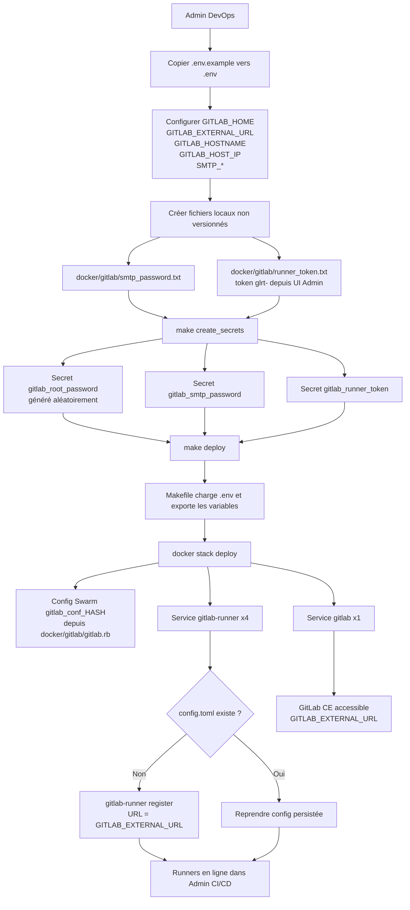
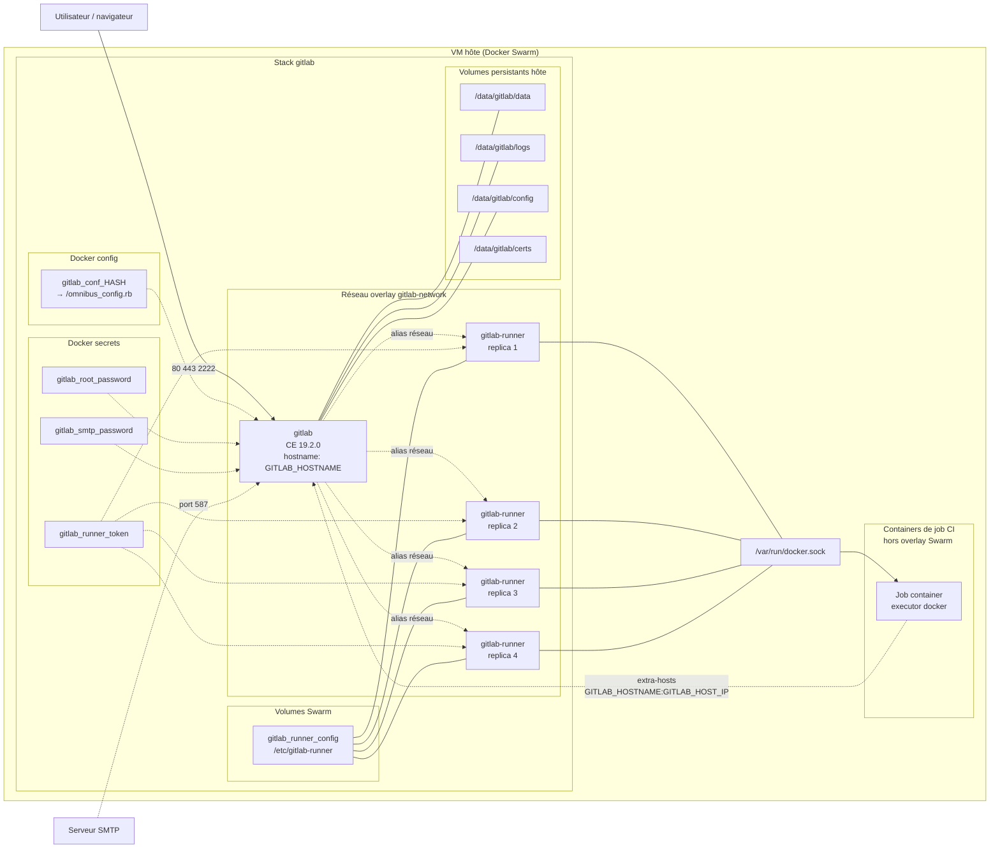
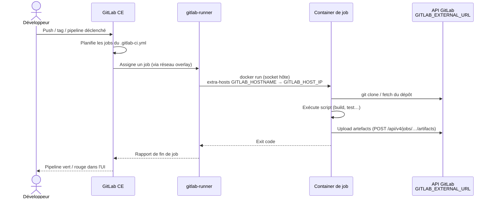
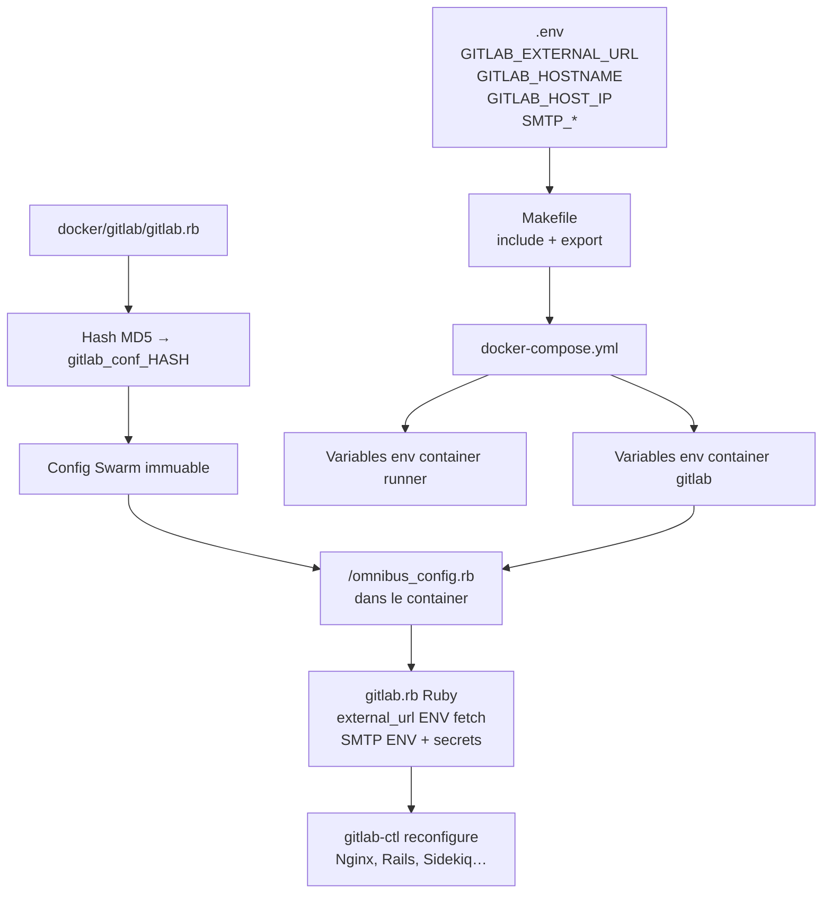

# Déploiement de GitLab CE avec Docker Swarm pour Seris

Ce guide décrit comment déployer et gérer une instance GitLab CE dans un environnement Docker Swarm pour l'entreprise **Seris**. Il inclut les prérequis, la configuration des volumes persistants, la gestion des secrets et les étapes pour réinitialiser l'instance si nécessaire.

---

## Prérequis

* Docker CE installé sur la machine hôte (Ubuntu 24.04 ou similaire)
* Docker Compose (version compatible avec Swarm)
* Accès root ou sudo sur la machine hôte
* Ports ouverts :

  * SSH GitLab : 2222 (ou un autre si personnalisé)
  * HTTP : 80
  * HTTPS : 443

---

## Étape 1 : Initialiser le mode Swarm

Si le Docker Swarm n'est pas encore activé sur le serveur hôte :

```bash
docker swarm init
```

> Cela permet d'utiliser `docker stack deploy` et de gérer les services en mode Swarm.

---

## Étape 2 : Préparer les volumes persistants

1. Créer les répertoires sur la VM pour les données GitLab (incluant le répertoire pour les certificats SSL) :

```bash
sudo rm -rf /data/gitlab/*
sudo mkdir -p /data/gitlab/data /data/gitlab/logs /data/gitlab/config /data/gitlab/certs
sudo chown -R 1000:1000 /data/gitlab
```

> **Important** : le répertoire `/data/gitlab/certs` doit contenir les certificats TLS utilisés par GitLab (si vous activez HTTPS). Placez les fichiers avec les noms exacts ci‑dessous :
>
> * `/data/gitlab/certs/gitlab.securit.fr.crt`
> * `/data/gitlab/certs/gitlab.securit.fr.key`
>
> Ces chemins correspondent à la configuration `gitlab.rb` (`gitlab_rails['nginx']['ssl_certificate']` et `ssl_certificate_key`).

2. Copier `.env.example` vers `.env` et adapter les valeurs :

```bash
cp .env.example .env
```

Exemple de contenu (voir `.env.example`) :

```bash
GITLAB_HOME=/data/gitlab

# URL complète pour Omnibus (external_url) — avec schéma http/https
GITLAB_EXTERNAL_URL=http://gitlab.local
# Hostname seul (sans schéma) pour Docker hostname, aliases réseau et runners
GITLAB_HOSTNAME=gitlab.local

# IP de la VM hôte : utilisée par les containers de job CI pour résoudre GITLAB_HOSTNAME
GITLAB_HOST_IP=172.16.100.121

# SMTP (valeurs non sensibles — le mot de passe est géré via Docker secret)
SMTP_ADDRESS=mta.securit.fr
SMTP_PORT=587
SMTP_USER_NAME="GitLab Notifier <gitlab-info@seris.fr>"
SMTP_DOMAIN=securit.fr
```

> Le fichier `.env` n'est **pas versionné** (`.gitignore`). Le `Makefile` le charge automatiquement (`include .env` + `export`), et ces variables sont substituées dans `docker-compose.yml` puis lues par `gitlab.rb` via `ENV['...']`.
>
> **`GITLAB_EXTERNAL_URL`** : URL complète (ex. `http://gitlab.local` ou `https://gitlab.securit.fr`) — utilisée pour `external_url` et l'enregistrement des runners.
>
> **`GITLAB_HOSTNAME`** : nom d'hôte seul, **sans** `http://` (ex. `gitlab.local`) — utilisé pour le hostname Docker, les aliases réseau Swarm et la résolution DNS dans les jobs CI.
>
> Si vous déployez sans le Makefile, exportez d'abord les variables dans le shell (y compris le hash de la config, cf. plus bas) :
>
> ```bash
> set -a; source .env; set +a
> export GITLAB_CONFIG_HASH=$(md5sum docker/gitlab/gitlab.rb | cut -c1-8)
> ```
>
> **Note** : les configs Docker Swarm sont **immuables**. Le nom de la config (`gitlab_conf_<hash>`) inclut le hash de `gitlab.rb` : toute modification du fichier crée une nouvelle config au lieu d'échouer avec l'erreur `only updates to Labels are allowed`. Le Makefile calcule ce hash automatiquement et supprime les anciennes configs après chaque déploiement.

3. Vérifier que les volumes sont correctement mappés dans le `docker-compose.yml` :

```yaml
volumes:
  - ${GITLAB_HOME}/data:/var/opt/gitlab
  - ${GITLAB_HOME}/logs:/var/log/gitlab
  - ${GITLAB_HOME}/config:/etc/gitlab
```

---

## Étape 3 : Créer les secrets (mot de passe root + mot de passe SMTP)

Il est recommandé de **ne pas versionner** les mots de passe. Créez les secrets Docker :

```bash
cd gitlab-ce
docker secret rm gitlab_root_password
openssl rand -base64 24 | tee ./docker/gitlab/root_password.txt | docker secret create gitlab_root_password -

# Mot de passe SMTP (fichier non versionné, cf. .gitignore)
echo "<mot-de-passe-smtp>" > ./docker/gitlab/smtp_password.txt
docker secret rm gitlab_smtp_password 2>/dev/null
docker secret create gitlab_smtp_password ./docker/gitlab/smtp_password.txt

# Token d'enregistrement des runners CI (fichier non versionné)
# À créer dans l'UI : Espace d'administration -> CI/CD -> Runners -> "Créer un runner d'instance"
echo "glrt-..." > ./docker/gitlab/runner_token.txt
docker secret rm gitlab_runner_token 2>/dev/null
docker secret create gitlab_runner_token ./docker/gitlab/runner_token.txt
```

> **Runners CI** : les replicas `gitlab-runner` (4 par défaut) s'enregistrent automatiquement au démarrage avec ce token (executor `docker`). La variable `GITLAB_HOST_IP` du `.env` doit contenir l'IP de la VM pour que les containers de job résolvent `GITLAB_HOSTNAME`. La configuration du runner est persistée dans le volume Swarm `gitlab_runner_config`.

> Le secret `gitlab_root_password` sera injecté dans GitLab au démarrage pour définir le mot de passe initial du compte `root`. Le secret `gitlab_smtp_password` est lu par `gitlab.rb` depuis `/run/secrets/gitlab_smtp_password`.
>
> Alternativement, `make create_secrets` crée les trois secrets automatiquement (fichiers requis : `smtp_password.txt` et `runner_token.txt` dans `docker/gitlab/`). Cette cible est **idempotente** : les secrets déjà existants sont conservés, ce qui permet de l'exécuter sans risque sur une instance en production.

---

## Étape 4 : Déployer la stack GitLab

Avec les volumes et les secrets prêts :

```bash
make deploy
```

Ou manuellement (après avoir exporté le `.env`, cf. ci-dessus) :

```bash
docker stack deploy -c docker-compose.yml gitlab
```

Cette commande :

* Crée les services `gitlab` (GitLab CE 19.2.0) et `gitlab-runner` (4 replicas)
* Monte les volumes persistants
* Injecte les secrets (root, SMTP, runner)
* Applique la configuration définie dans `gitlab.rb` (config Swarm versionnée par hash)

---

## Étape 5 : Vérification

* Vérifier les services :

```bash
docker service ls
docker service ps gitlab
```

* Vérifier les containers :

```bash
docker ps
```

* Vérifier les logs GitLab :

```bash
docker service logs gitlab
```

---

## Réinitialisation de l'instance GitLab

Si vous devez **réinitialiser complètement la configuration** :

1. Supprimer la stack :

```bash
docker stack rm gitlab
```

2. Supprimer les services et secrets existants :

```bash
docker config ls --format '{{.Name}}' | grep '^gitlab_conf_' | xargs -r docker config rm
docker secret rm gitlab_root_password 2>/dev/null
docker secret rm gitlab_smtp_password 2>/dev/null
docker secret rm gitlab_runner_token 2>/dev/null
```

3. Supprimer les containers résiduels (si nécessaire) :

```bash
docker rm -f $(docker ps -aq --filter "name=gitlab")
```

4. Créer à nouveau les secrets et vérifier les volumes persistants.
5. Déployer la stack avec `make deploy` (ou `docker stack deploy -c docker-compose.yml gitlab`).

---

## Notes importantes

* Les mots de passe et tokens doivent **toujours être gérés via Docker secrets** ou fichiers non versionnés (`.gitignore`).
* Les volumes persistants doivent être créés avec les permissions correctes (`chown -R 1000:1000`) pour permettre au conteneur GitLab de fonctionner correctement.
* L'`external_url` est configuré via **`GITLAB_EXTERNAL_URL`** dans le `.env` (pas de modification manuelle de `gitlab.rb` pour changer l'URL).
* Pour les **artefacts CI volumineux** (ex. installateurs Electron), augmenter la limite dans l'admin : **Paramètres → CI/CD → Taille maximale des artefacts** (défaut 100 Mo).
* **GitLab Pages** (optionnel) : décommenter `pages_external_url` et `gitlab_pages['namespace_in_path']` dans `docker/gitlab/gitlab.rb`, puis `make deploy`.

---

## Flux fonctionnel (Mermaid)

### 1. Déploiement initial



### 2. Architecture runtime



### 3. Exécution d'un job CI/CD



### 4. Configuration injectée



> Les diagrammes ci-dessus décrivent le flux de déploiement, l'architecture Swarm, l'exécution CI/CD et l'injection de configuration pour l'instance GitLab CE Seris.

---

> Ce guide est destiné à l'équipe DevOps de **Seris** pour déployer et gérer GitLab de manière sécurisée et reproductible dans un environnement Docker Swarm.
